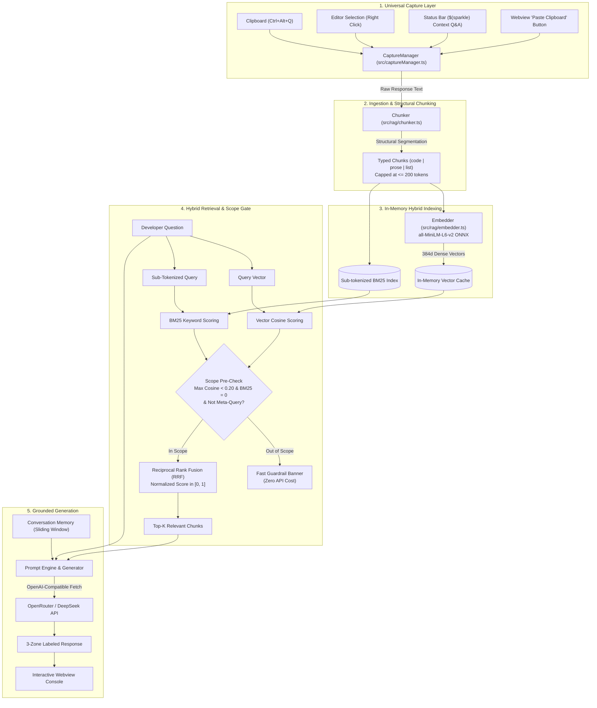

<div align="center">

# 🤖 Agentic Chat Q&A Bot

### *Universal Scoped RAG & Contextual Q&A Console for AI Agent Responses*

[](https://code.visualstudio.com/)
[](https://www.typescriptlang.org/)
[-blueviolet)](https://huggingface.co/Xenova/all-MiniLM-L6-v2)
[](#-privacy--security)
[](LICENSE)

<p align="center">
  <b>Eliminate context dilution, prevent AI hallucinations, and interrogate complex agent responses inside an isolated, mathematically grounded RAG sandbox.</b>
</p>

[Key Advantages](#-why-agentic-chat-qa-bot) •
[Architecture](#-system-architecture) •
[Quick Start](#-quick-start) •
[How It Works](#-how-it-works) •
[Configuration](#-configuration) •
[Documentation](#-documentation-index)

</div>

---

## ⚡ The Problem: Context Drift & Lost Context in Modern AI IDEs

Modern AI assistants (**Google Antigravity**, **Cursor**, **GitHub Copilot Chat**, **Claude Dev**) frequently output massive responses: multi-step refactoring strategies, architectural blueprints, or dense terminal command sequences.

When developers need to ask follow-up questions about that *specific* output, asking inside the primary conversation triggers several critical problems:
1. **Context Dilution:** The active conversational history expands rapidly, pushing crucial architectural rules and instructions out of the LLM's effective context window.
2. **Drift & Hallucination:** The agent frequently confuses conversational follow-ups with instructions to edit active workspace code, leading to destructive unintended changes.
3. **Expensive Token Burn:** Feeding entire multi-thousand-token conversational transcripts back to remote LLM endpoints for small clarifying questions burns API quota and introduces significant latency.
4. **No Verification or Grounding:** Developers have no way to verify whether the agent's follow-up explanation accurately reflects its original response or is an ad-hoc hallucination.

---

## 🚀 The Solution: Scoped Sandbox RAG

**Agentic Chat Q&A Bot** solves this by providing a dedicated, lightweight, scoped Q&A console:

* **Capture Any AI Response in 1-Click:** Grab any response turn instantly via `Ctrl+Alt+Q` (or `Cmd+Alt+Q`), status bar icon, right-click context menu, or Webview paste button.
* **100% Local, Offline Embeddings:** Embedded directly on your CPU via `@xenova/transformers` (`all-MiniLM-L6-v2` running on WebAssembly/ONNX). **Zero code or text is ever transmitted over the network for embedding.**
* **In-Memory Hybrid Retrieval:** Sub-tokenized BM25 keyword search + dense vector cosine similarity fused with **Reciprocal Rank Fusion (RRF)** in $< 0.5\text{ms}$.
* **Scope Guardrail Short-Circuit:** Automatically detects off-topic queries before making an LLM API call, preventing wasted tokens and irrelevant answers.
* **3-Zone Grounded Answers:** Answers clearly distinguish between direct factual statements extracted from the captured response (`[📌 From Context]`) and deep-dive conceptual expansions (`[🌐 Deep-Dive & Implementation]`).

---

## 🌟 Key Features & Advantages

### 🔒 100% Private & Local-First Vectorization
Your code and agent explanations never leave your machine during indexing. We run quantized ONNX embeddings locally in-process without requiring Python or external C++ compilers.

### 🛡️ Zero Dependency Fragility (No Native C++ Vector DB Crashes)
Traditional extensions relying on native bindings (`better-sqlite3`, `sqlite-vec`, `lancedb`) consistently break whenever VS Code updates its underlying Electron ABI version. Because single AI responses contain 5–35 chunks, our in-memory TypeScript array vector engine delivers **sub-millisecond retrieval** with **zero ABI crash risk**.

### 🌐 Universal IDE Compatibility
Built purely on standard, supported VS Code Extension APIs. Runs seamlessly across:
- **VS Code** (Standard & Insiders)
- **Google Antigravity IDE**
- **Cursor**
- **Windsurf**

### 🧠 Bring Your Own Model (BYOM)
Connects to any OpenAI-compatible chat completion endpoint:
- **OpenRouter** (DeepSeek V3/R1, Llama 3.3, Claude 3.5, Mistral)
- **DeepSeek API** directly
- **Local LLMs** via Ollama, LM Studio, or vLLM
- **OpenAI / Azure OpenAI**

---

## 📐 System Architecture



---

## 🚦 How It Works: Step-by-Step

| Step | Action | Description |
|---|---|---|
| **1. Capture** | `Ctrl+Alt+Q` | Copy an AI response turn and trigger capture. The console panel opens instantly with a character & token badge. |
| **2. Chunk** | Structural Parser | Divides the text into typed blocks (`code`, `prose`, `list`). Preserves code blocks atomically and caps chunks at $\le 200$ tokens to respect the embedding context window. |
| **3. Index** | Local ONNX | Computes 384-dimensional dense vectors using `all-MiniLM-L6-v2` and indexes identifier keywords (`getUserById` $\rightarrow$ `['get', 'user', 'by', 'id']`). |
| **4. Retrieve** | RRF Hybrid Fusion | Scores chunks using both dense semantics and exact keyword matches, ranking top matches via Reciprocal Rank Fusion ($k=60$). |
| **5. Answer** | 3-Zone Generation | Feeds only the relevant context into the LLM, outputting citations for factual statements and labeled badges for extended technical explanations. |

---

## 🏁 Quick Start

### Prerequisites
- **Node.js**: `v18.0.0` or higher
- **VS Code**: `v1.85.0` or higher (or compatible IDE like Antigravity / Cursor)

### 1. Installation & Setup
```bash
# Clone the repository
git clone https://github.com/abhishek3059/Agentic-chat-QA-bot.git
cd Agentic-chat-QA-bot

# Install dependencies
npm install

# Compile TypeScript
npm run compile
```

### 2. Run in Development
1. Open the repository folder in VS Code.
2. Press **`F5`** to launch a new **Extension Development Host** window.
3. In the new window:
   - Copy any text or AI assistant response to your clipboard.
   - Press **`Ctrl+Alt+Q`** (or **`Cmd+Alt+Q`** on macOS).
   - The **Context Q&A Console** will open with the captured context ready for interrogation.

### 3. Running Automated Tests
```bash
npm test
```

---

## ⚙️ Configuration

You can configure settings in your VS Code `settings.json` or via the **Settings UI** under **Context Q&A**:

| Setting Key | Default Value | Description |
|---|---|---|
| `contextQa.apiBaseUrl` | `https://openrouter.ai/api/v1` | Base URL for OpenAI-compatible completions API |
| `contextQa.modelName` | `deepseek/deepseek-chat` | Model identifier to call for answer generation |
| `contextQa.topK` | `3` | Number of most relevant context chunks to retrieve |
| `contextQa.maxTokensPerChunk` | `200` | Target token ceiling per chunk for embedding alignment |

### Setting Your API Key Securely
Run the VS Code command:
```
Context Q&A: Set LLM API Key
```
Keys are stored exclusively in VS Code's encrypted **`SecretStorage`** and are never logged or committed to disk.

---

## ⌨️ Commands & Shortcuts

| Command | Keybinding | Action |
|---|---|---|
| `contextQa.captureClipboard` | `Ctrl+Alt+Q` / `Cmd+Alt+Q` | Capture current clipboard text into the Q&A Console |
| `contextQa.openPanel` | — | Open the Context Q&A Agent Console |
| `contextQa.askAboutSelection` | Right-Click Menu | Send highlighted editor code/text to the Q&A Console |
| `contextQa.setApiKey` | — | Securely configure LLM API key in `SecretStorage` |
| `contextQa.simulateCapture` | — | Manually paste or type test context into the console |

---

## 📚 Documentation Index

The repository contains comprehensive technical documentation:

- 📋 **[docs/PRD.md](docs/PRD.md):** Product Requirements, User Personas, and Core User Scenarios.
- 📐 **[docs/ARCHITECTURE.md](docs/ARCHITECTURE.md):** Detailed Technical Design, Math Formulations, and Data Flow.
- 🧩 **[docs/chunking-strategy.md](docs/chunking-strategy.md):** Structural Markdown & Code Chunking Strategy & 200-Token Safety Ceiling.
- 📝 **[docs/decisions.md](docs/decisions.md):** Architecture Decision Records (ADRs 001–012) with trade-offs and rationale.
- 🔄 **[docs/flow.md](docs/flow.md):** Complete Runtime Sequence Flow, Execution Traces, and Live Status Matrix.
- 🛠️ **[docs/BUILD.md](docs/BUILD.md):** Toolchain, Engine Compatibility, and Path-Safe Build Scripts.
- 📜 **[Agents.md](Agents.md):** Rules of Engagement, Code Conventions, and Collaboration Guidelines.

---

## 🛡️ Privacy & Security

- **Zero Telemetry:** No analytics, user tracking, or metrics collection.
- **Local Embeddings:** Embedding calculations take place 100% offline on your device.
- **Encrypted Key Storage:** API keys are never stored in plain text or settings files; they reside in operating system keychains via VS Code `SecretStorage`.
- **Grounded Scope Enforcement:** The system short-circuits unrelated questions to prevent unnecessary data transfer to LLM providers.

---

## 📄 License

This project is licensed under the [MIT License](LICENSE).
