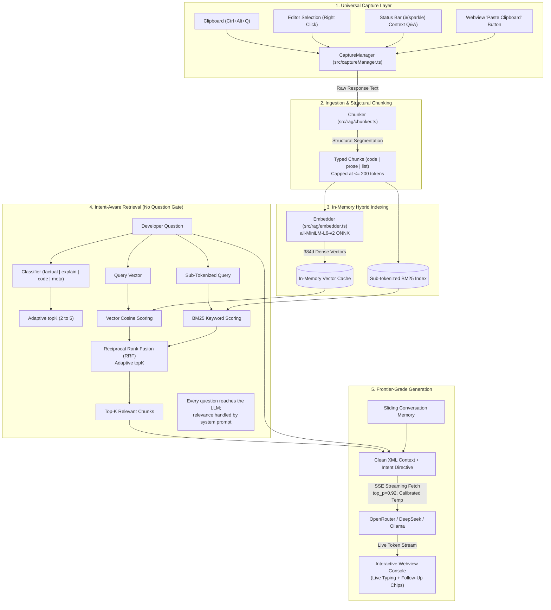

<div align="center">

# 🤖 QA Assistant

### *Universal Scoped RAG & Contextual Q&A Console for AI Agent Responses*

[](https://code.visualstudio.com/)
[](https://www.typescriptlang.org/)
[-blueviolet)](https://huggingface.co/Xenova/all-MiniLM-L6-v2)
[](#-privacy--security)
[](LICENSE)

<p align="center">
  <b>Eliminate context dilution, prevent AI hallucinations, and interrogate complex agent responses inside an isolated, mathematically grounded RAG sandbox.</b>
</p>

[Install](#-install) •
[Getting Started](#-getting-started-in-2-minutes) •
[Key Advantages](#-why-agentic-chat-qa-bot) •
[Architecture](#-system-architecture) •
[Quick Start](#-quick-start) •
[How It Works](#-how-it-works) •
[Configuration](#-configuration) •
[What's New](#-whats-new) •
[Documentation](#-documentation-index)

</div>

---

## 📦 Install

- **From the Marketplace:** search **“QA Assistant”** in the Extensions view
  (`Ctrl+Shift+X`) and click Install — or install the `.vsix` via
  `code --install-extension agentic-chat-qa-bot-<version>.vsix`.
- **Requirements:** VS Code `v1.85.0` or higher (also runs on Antigravity,
  Cursor, and Windsurf). An LLM provider API key, unless you use local Ollama.

---

## 🚀 Getting Started in 2 Minutes

After install, open the **Welcome → Get Started** page for the interactive
**“Get Started with QA Assistant”** walkthrough, or follow these steps:

1. **Choose your provider** — Command Palette → `QA Assistant: Configure LLM Provider`
   (OpenAI, OpenRouter, DeepSeek, Ollama, or a Custom OpenAI-compatible endpoint).
2. **Save your API key** — Command Palette → `QA Assistant: Set LLM API Key`
   (stored in encrypted SecretStorage; not needed for Ollama).
3. **Capture a response** — copy any AI agent reply, then press `Ctrl+Alt+Q`
   (`Cmd+Alt+Q` on Mac).
4. **Ask away** — try *“Explain this simpler”*. Click the model name in the
   sidebar footer to browse your provider's live model list (search + ☆ pin
   favorites).

## ⚡ The Problem: Context Drift & Lost Context in Modern AI IDEs

Modern AI assistants (**Google Antigravity**, **Cursor**, **GitHub Copilot Chat**, **Claude Dev**) frequently output massive responses: multi-step refactoring strategies, architectural blueprints, or dense terminal command sequences.

When developers need to ask follow-up questions about that *specific* output, asking inside the primary conversation triggers several critical problems:
1. **Context Dilution:** The active conversational history expands rapidly, pushing crucial architectural rules and instructions out of the LLM's effective context window.
2. **Drift & Hallucination:** The agent frequently confuses conversational follow-ups with instructions to edit active workspace code, leading to destructive unintended changes.
3. **Expensive Token Burn:** Feeding entire multi-thousand-token conversational transcripts back to remote LLM endpoints for small clarifying questions burns API quota and introduces significant latency.
4. **No Verification or Grounding:** Developers have no way to verify whether the agent's follow-up explanation accurately reflects its original response or is an ad-hoc hallucination.

---

## 🚀 The Solution: Scoped Sandbox RAG

**Agentic Chat Q&A Bot** solves this by providing a dedicated, lightweight, scoped Q&A console:

* **Capture Any AI Response in 1-Click:** Grab any response turn instantly via `Ctrl+Alt+Q` (or `Cmd+Alt+Q`), status bar icon, right-click context menu, or the Sidebar paste button.
* **100% Local, Offline Embeddings:** Embedded directly on your CPU via `@xenova/transformers` (`all-MiniLM-L6-v2` running on WebAssembly/ONNX). **Zero code or text is ever transmitted over the network for embedding.**
* **In-Memory Hybrid Retrieval:** Sub-tokenized BM25 keyword search + dense vector cosine similarity fused with **Reciprocal Rank Fusion (RRF)** in $< 0.5\text{ms}$.
* **LLM-Level Relevance Handling:** Every question reaches the model with retrieved context; the system prompt instructs it to say plainly when the context doesn't cover the question instead of answering from undisclosed general knowledge.
* **Frontier-Grade Conversational Delivery:** Eliminates robotic boilerplate preambles, artificial split cards, and bracketed citation clutter. Delivers direct senior-engineer answers, syntax-safe code with proactive gotchas, and real-time SSE token streaming.

---

## 🌟 Key Features & Advantages

### 🚀 Real-Time SSE Token Streaming
Responses stream token-by-token directly into the console with a live blinking cursor and smooth rendering, eliminating multi-second batch wait times.

### 🎯 Intent-Aware Routing & Adaptive Sampling
Zero-latency query classifier categorizes prompts into `factual`, `explain`, `code`, or `meta`:
- **Adaptive `topK`:** Pulls 2 chunks for precise factual answers, scaling to 4–5 for code implementations.
- **Calibrated Temperatures:** $T=0.20$ for deterministic code syntax, $T=0.35$ for facts, $T=0.55$ for pedagogical explanations.
- **Nucleus Sampling (`top_p: 0.92`):** Cuts improbable token tails before sampling to prevent hallucinated APIs and parameters.

### 💡 Interactive Follow-Up Chips
Dynamic, intent-aware suggestion chips appear beneath answers for immediate, single-click follow-up questions.

### 🔒 100% Private & Local-First Vectorization
Your code and agent explanations never leave your machine during indexing. We run quantized ONNX embeddings locally in-process without requiring Python or external C++ compilers.

### 🛡️ Zero Dependency Fragility (No Native C++ Vector DB Crashes)
Traditional extensions relying on native bindings (`better-sqlite3`, `sqlite-vec`, `lancedb`) consistently break whenever VS Code updates its underlying Electron ABI version. Because single AI responses contain 5–35 chunks, our in-memory TypeScript array vector engine delivers **sub-millisecond retrieval** with **zero ABI crash risk**.

### 🌐 Universal IDE Compatibility
Built purely on standard, supported VS Code Extension APIs. Runs seamlessly across:
- **VS Code** (Standard & Insiders)
- **Google Antigravity IDE**
- **Cursor**
- **Windsurf**

### 🧠 Bring Your Own Model (BYOM)
Connects to any OpenAI-compatible chat completion endpoint. Pick a provider from
**Settings → QA Assistant → Provider** (or the `QA Assistant: Configure LLM Provider`
command), set your key, then click the model name in the sidebar to browse that
provider's live model list:
- **OpenRouter** (DeepSeek V3/R1, Llama 3.3, Claude 3.5/3.7, Mistral)
- **DeepSeek API** directly
- **Local LLMs** via Ollama, LM Studio, or vLLM
- **OpenAI / Azure OpenAI** (via Custom endpoint)

---

## 📐 System Architecture



---

## 🚦 How It Works: Step-by-Step

| Step | Action | Description |
|---|---|---|
| **1. Capture** | `Ctrl+Alt+Q` | Copy an AI response turn and trigger capture. The sidebar opens instantly with character & token stats. |
| **2. Chunk** | Structural Parser | Divides the text into typed blocks (`code`, `prose`, `list`). Preserves code blocks atomically and caps chunks at $\le 200$ tokens to respect the embedding context window. |
| **3. Index** | Local ONNX | Computes 384-dimensional dense vectors using `all-MiniLM-L6-v2` and indexes identifier keywords (`getUserById` $\rightarrow$ `['get', 'user', 'by', 'id']`). |
| **4. Retrieve** | Intent-Aware Fusion | Classifies query intent and scores chunks using dense semantics and keyword matches, ranking matches via Reciprocal Rank Fusion ($k=60$) with adaptive `topK`. |
| **5. Answer** | Real-Time SSE Stream | Injects clean XML context, streaming direct conversational answers token-by-token with syntax-safe code, proactive edge-case tips, and follow-up suggestion chips. |

---

## 🏁 Quick Start

### Prerequisites
- **Node.js**: `v18.0.0` or higher
- **VS Code**: `v1.85.0` or higher (or compatible IDE like Antigravity / Cursor)

### 1. Installation & Setup
```bash
# Clone the repository
git clone https://github.com/abhishek3059/Agentic-chat-QA-bot.git
cd Agentic-chat-QA-bot

# Install dependencies
npm install

# Compile TypeScript
npm run compile
```

### 2. Run in Development
1. Open the repository folder in VS Code.
2. Press **`F5`** to launch a new **Extension Development Host** window.
3. In the new window:
   - Copy any text or AI assistant response to your clipboard.
   - Press **`Ctrl+Alt+Q`** (or **`Cmd+Alt+Q`** on macOS).
   - The **Context Q&A Sidebar** will open with the captured context ready for interrogation.

### 3. Running Automated Tests
```bash
npm test
```

---

## ⚙️ Configuration

You can configure settings in your VS Code `settings.json` or via the **Settings UI** under **QA Assistant**:

| Setting Key | Default Value | Description |
|---|---|---|
| `contextQa.provider` | `openrouter` | LLM provider dropdown: `openai`, `openrouter`, `deepseek`, `ollama`, or `custom` |
| `contextQa.apiBaseUrl` | `""` (empty) | Base URL override — only used when provider is `custom`; presets resolve automatically |
| `contextQa.modelName` | `deepseek/deepseek-chat` | Model identifier to call for answer generation (or pick from the sidebar model list) |
| `contextQa.topK` | `3` | Base number of context chunks (adapted dynamically 2–5 by intent) |
| `contextQa.maxTokensPerChunk` | `200` | Target token ceiling per chunk for embedding alignment |
| `contextQa.temperature` | `0.45` | Global temperature override (defaults to calibrated intent profiles if 0.45) |
| `contextQa.topP` | `0.92` | Nucleus sampling cutoff threshold (0.0 to 1.0) |
| `contextQa.streaming` | `true` | Real-time Server-Sent Events (SSE) token streaming in console |

### Setting Your API Key Securely
Run the VS Code command:
```
QA Assistant: Set LLM API Key
```
Keys are stored exclusively in VS Code's encrypted **`SecretStorage`** and are never logged or committed to disk. No key is needed for local Ollama.

To switch providers, run `QA Assistant: Configure LLM Provider` or change
**Settings → QA Assistant → Provider**. Changing provider or base URL refreshes
the sidebar automatically; click the model name there to fetch that provider's
available models. Type in the search box to narrow large lists (e.g. OpenRouter's
400+ models), and click the ☆ star to pin favorites to the top — pins persist
across sessions.

---

## ⌨️ Commands & Shortcuts

| Command | Keybinding | Action |
|---|---|---|
| `contextQa.captureClipboard` | `Ctrl+Alt+Q` / `Cmd+Alt+Q` | Capture current clipboard text into the Q&A Console |
| `contextQa.openPanel` | — | Open the Context Q&A Agent Console |
| `contextQa.askAboutSelection` | Right-Click Menu | Send highlighted editor code/text to the Q&A Console |
| `contextQa.setApiKey` | — | Securely configure LLM API key in `SecretStorage` |
| `contextQa.configureProvider` | — | Pick the LLM provider (OpenAI, OpenRouter, DeepSeek, Ollama, Custom) |
| `contextQa.simulateCapture` | — | Manually paste or type test context into the console |

---

## 🆕 What's New

See [CHANGELOG.md](CHANGELOG.md) for release notes. Current version: **0.1.0**
— scoped Q&A console, local hybrid RAG, multi-provider support with live model
picker, and the Get Started walkthrough.

---

## 📚 Documentation Index

The repository contains comprehensive technical documentation:

- 📋 **[docs/PRD.md](docs/PRD.md):** Product Requirements, User Personas, and Core User Scenarios.
- 📐 **[docs/ARCHITECTURE.md](docs/ARCHITECTURE.md):** Detailed Technical Design, Math Formulations, and Data Flow.
- 🧩 **[docs/chunking-strategy.md](docs/chunking-strategy.md):** Structural Markdown & Code Chunking Strategy & 200-Token Safety Ceiling.
- 📝 **[docs/decisions.md](docs/decisions.md):** Architecture Decision Records (ADRs 001–014) with trade-offs and rationale.
- 🔄 **[docs/flow.md](docs/flow.md):** Complete Runtime Sequence Flow, Execution Traces, and Live Status Matrix.
- 🛠️ **[docs/BUILD.md](docs/BUILD.md):** Toolchain, Engine Compatibility, and Path-Safe Build Scripts.
- 📜 **[Agents.md](Agents.md):** Rules of Engagement, Code Conventions, and Collaboration Guidelines.

---

## 🛡️ Privacy & Security

- **Zero Telemetry:** No analytics, user tracking, or metrics collection.
- **Local Embeddings:** Embedding calculations take place 100% offline on your device.
- **Encrypted Key Storage:** API keys are never stored in plain text or settings files; they reside in operating system keychains via VS Code `SecretStorage`.
- **Grounded Relevance Handling:** The system prompt requires the model to disclose when retrieved context doesn't cover a question, instead of silently answering from general knowledge.

---

## 📄 License

This project is licensed under the [MIT License](LICENSE).
