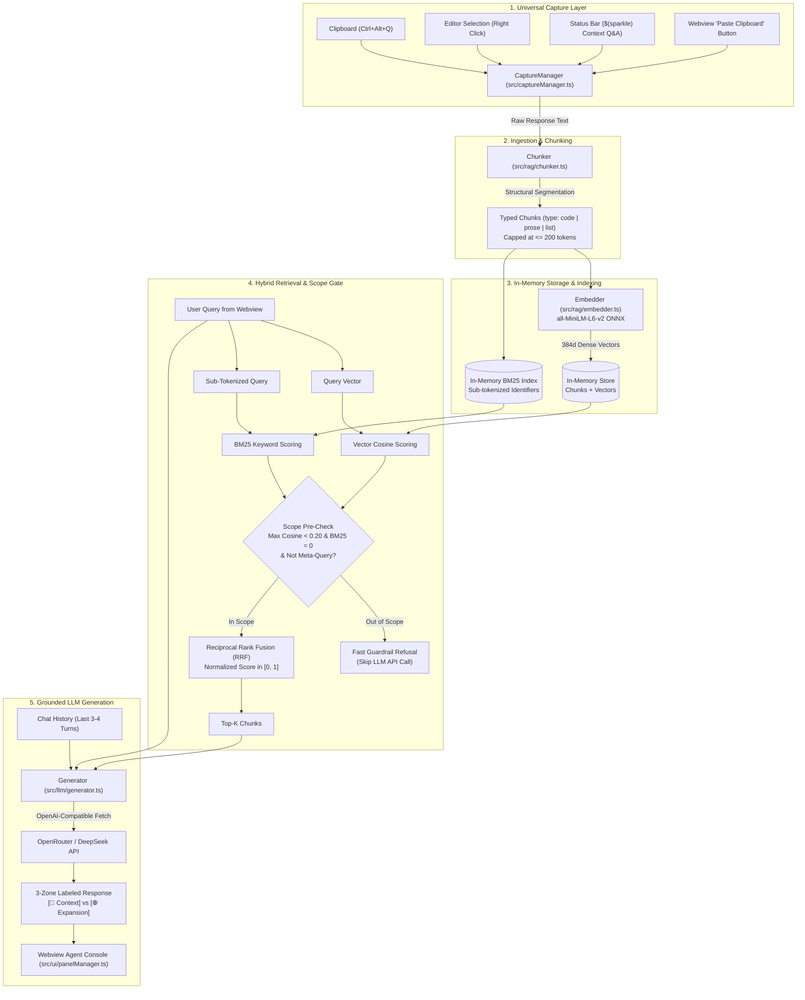

# System Architecture & Technical Specification (ARCHITECTURE.md)

## Document Details
- **Document Version:** 1.0.0
- **Status:** Active / Engineering Blueprint
- **Key Modules:** Ingestion, Structural Chunking, In-Memory Hybrid Retrieval, LLM Generation, Webview
- **Related Live Documents:**
  - [docs/decisions.md](file:///a:/Personal/projects/Agentic-chat-Q&A-bot/docs/decisions.md): Architecture Decision Records (ADRs 001–012) with context, options, decisions, and rationale.
  - [docs/flow.md](file:///a:/Personal/projects/Agentic-chat-Q&A-bot/docs/flow.md): End-to-end runtime sequence flow, traces, and file-by-file live implementation tracking.
  - [docs/chunking-strategy.md](file:///a:/Personal/projects/Agentic-chat-Q&A-bot/docs/chunking-strategy.md): Detailed specification and algorithmic breakdown of the structural code & markdown chunker.

---

## 1. System Overview & End-to-End Data Flow

The **Agentic Chat Q&A Bot** is structured into five decoupled pipeline stages:



---

## 2. In-Memory Array Decision (No Vector Database)

### Rationale
1. **Bounded Document Scope:** A captured AI response is typically 500 to 5,000 words ($\approx 5$ to $35$ chunks). An indexed database (Pinecone, Chroma, LanceDB) is designed for millions of records and introduces unnecessary disk overhead.
2. **Electron ABI Safety:** Native modules (`better-sqlite3`, `sqlite-vec`) break on Electron version mismatches in VS Code extensions. An in-memory JavaScript array has **zero native dependencies** and zero build failures.
3. **Microsecond Latency:** Computing cosine similarity and BM25 scores over 30 in-memory JavaScript objects takes **$< 0.5\text{ms}$**, which is vastly faster than any IPC or socket call to an external database.

---

## 3. Structural Chunking Specification ([chunker.ts](file:///a:/Personal/projects/Agentic-chat-Q&A-bot/src/rag/chunker.ts))

### 3.1 Chunk Data Contract ([types.ts](file:///a:/Personal/projects/Agentic-chat-Q&A-bot/src/rag/types.ts))
```typescript
export type ChunkType = 'code' | 'prose' | 'list';

export interface Chunk {
  id: string;              // Deterministic ID (e.g., 'chunk-0')
  text: string;            // Content of the chunk
  type: ChunkType;         // Structural classification
  language?: string;       // e.g. 'typescript', 'python', 'json'
  tokenCount: number;      // Estimated tokens (1 token ≈ 4 chars)
  charRange: [number, number]; // [start, end] in original text
}
```

### 3.2 The 200-Token Sequence Ceiling Rule
* **Model Constraint:** `all-MiniLM-L6-v2` has a hard sequence length limit of **256 WordPiece tokens**. Any chunk exceeding 256 tokens is silently truncated by the model at inference time.
* **Target Ceiling:** We enforce `maxTokensPerChunk = 200`, providing safe headroom below the 256 limit.

### 3.3 Splitting Rules
1. **Code Blocks as Atomic Units:** Markdown fenced code blocks (` ```lang ... ``` `) are extracted first and preserved whole if $\le 200$ tokens.
2. **Oversized Code Blocks:** If a code block exceeds 200 tokens, it is split strictly along newline/statement boundaries, carrying a 2-line overlap and preserving the opening and closing ```lang fences so syntax highlighting and scope remain intact.
3. **Prose & Lists:** Paragraphs are split on `\n\s*\n`. Paragraphs exceeding 200 tokens are split cleanly on sentence terminators (`.`, `!`, `?`).

---

## 4. Local Offline Embeddings ([embedder.ts](file:///a:/Personal/projects/Agentic-chat-Q&A-bot/src/rag/embedder.ts))

* **Model:** `Xenova/all-MiniLM-L6-v2` (quantized ONNX).
* **Embedding Dimension:** 384 dimensions ($L_2$ normalized dense vectors).
* **Execution:** Runs in the extension host process via pure WebAssembly / ONNX runtime.
* **Privacy Guarantee:** Zero document text is transmitted over the network for vector generation.

---

## 5. In-Memory Hybrid Retrieval Algorithm ([retriever.ts](file:///a:/Personal/projects/Agentic-chat-Q&A-bot/src/rag/retriever.ts))

### 5.1 Symmetric Sub-Tokenization for Code Identifiers
Standard whitespace tokenization fails when matching queries like *"how to get user by id"* against identifier `getUserById`.

Both document text and search queries pass through an identical sub-tokenizing function:
```typescript
export function tokenizeCodeAndProse(text: string): string[] {
  return text
    .replace(/([a-z])([A-Z])/g, '$1 $2') // camelCase -> camel Case
    .replace(/[_\-.]+/g, ' ')            // snake_case, kebab-case -> spaces
    .toLowerCase()
    .split(/\W+/)
    .filter(token => token.length > 1);
}
```
*Example:* `getUserById` $\rightarrow$ `['get', 'user', 'by', 'id', 'getuserbyid']`.

### 5.2 Cosine Similarity Formula
Given query vector $\vec{q}$ and chunk vector $\vec{d}$:
$$\text{Cosine}(q, d) = \frac{\vec{q} \cdot \vec{d}}{\|\vec{q}\|_2 \|\vec{d}\|_2} \in [0, 1]$$

### 5.3 BM25 Keyword Formula
For query terms $Q = \{q_1, \dots, q_n\}$ and document $D$:
$$\text{BM25}(D, Q) = \sum_{i=1}^{n} \text{IDF}(q_i) \cdot \frac{f(q_i, D) \cdot (k_1 + 1)}{f(q_i, D) + k_1 \cdot \left(1 - b + b \cdot \frac{|D|}{\text{avgdl}}\right)}$$
*Parameters:* $k_1 = 1.5$, $b = 0.75$.

### 5.4 Reciprocal Rank Fusion (RRF) & UI Normalization
Rankings from Vector search and BM25 are fused using RRF with constant $k = 60$:
$$\text{RRF}(d) = \frac{1}{60 + \text{Rank}_{\text{BM25}}(d)} + \frac{1}{60 + \text{Rank}_{\text{Vector}}(d)}$$

To provide an intuitive confidence score $[0, 1]$ in the UI, we divide by the theoretical maximum score (rank 1 in both lists):
$$\text{Score}_{\text{norm}}(d) = \frac{\text{RRF}(d)}{2 / 61} \in [0, 1]$$

---

## 6. Guardrails & The 3-Zone Relevance Matrix

### 6.1 Fast Pre-Check (Cost & Latency Saver)
Before calling the LLM endpoint:
1. If $\max(\text{Cosine}) < 0.20$ AND $\text{BM25 Matches} = 0$:
2. Check if the query is a **meta-transformation** (e.g., regex matching `/(explain|summarize|simpler|analogy|rephrase|break down)/i`).
3. If it is **not** a meta-transformation $\rightarrow$ immediately return:
   > *"This question is unrelated to the captured response. I am scoped to help you analyze this specific context."*

### 6.2 The 3-Zone Execution Matrix
```text
Zone 1: Direct Fact in Context      -> Cite [Chunk X] and answer strictly from text.
Zone 2: Context-Related Expansion   -> Output dual sections:
                                        [📌 From Captured Response]
                                        [🌐 Deep-Dive & Implementation (Expanded Knowledge)]
Zone 3: Out-of-Scope Noise          -> Polite refusal.
```

---

## 7. 3-Tier Instruction Hierarchy & Role Mappings ([prompt.ts](file:///a:/Personal/projects/Agentic-chat-Q&A-bot/src/llm/prompt.ts))

OpenAI-compatible APIs support three primary message roles: `"system"`, `"user"`, and `"assistant"`. We map our architecture onto these roles with high precision:

### 7.1 Role Mappings & Architectural Purpose
1. **`role: 'system'` (The Constitution & Grounded Context):**
   - **Why `system` for the constitution?** In LLM training, models prioritize `system` messages as immutable operational boundaries with higher authority than `user` messages, shielding the agent from prompt injection.
   - **Why `system` for retrieved chunks?** Injecting context as a `system` message signals to the model that the text is **trusted environment ground-truth** (like reference documentation), rather than something the user said.
2. **`role: 'assistant'` (Prior AI Conversation History):**
   - **Where is it used?** In multi-turn chat memory (`conversationHistory`).
   - When the user asks follow-up questions (e.g. *"Can you write a test for that?"* or *"Explain the second one"*), previous assistant responses are passed with `role: 'assistant'` so the model remembers its own prior explanations.
3. **`role: 'user'` (The Immediate Objective):**
   - The user's active question or command from the Webview input box.

---

### 7.2 The 3 Core Prompt Templates

```typescript
// 1. SYSTEM CONSTITUTION
export const SYSTEM_INSTRUCTION = `
You are the Agentic Chat Q&A Bot, a precision assistant analyzing a captured AI response.
Your job is to help the user understand, interrogate, and explore the captured context.

CORE RULES:
1. OUT-OF-SCOPE REJECTION:
   - If the user asks a question completely unrelated to the topic of the captured context (e.g. cooking recipes, sports, unrelated trivia):
   - Politely refuse: "This question is out of scope for the captured response. I am scoped to help you analyze this specific context."

2. EXPLANATION & PEDAGOGY (ALLOWED & ENCOURAGED):
   - If the user asks you to explain, simplify, translate, or provide an analogy for concepts THAT EXIST in the context:
   - You ARE ALLOWED to use clear analogies, simpler language, and step-by-step breakdowns.
   - You must remain faithful to the core ideas and facts in the text.

3. CONTEXT-GROUNDED EXPANSION (TRANSPARENT SOURCE BADGING):
   - If the user asks for deeper implementation details, code examples, or practical tutorials on a subtopic introduced in the context that lacks full code:
   - Structure your response into two explicitly labeled sections:
     ### 📌 From Captured Response:
     (Summarize what the captured text actually states about this topic, citing [Chunk X])
     
     ### 🌐 Deep-Dive & Implementation (Expanded Knowledge):
     (Provide the complete code implementation, best practices, and deep-dive)

4. DIRECT FACT CITATIONS:
   - When answering factual questions directly from the context, cite the relevant chunk ID (e.g. [Chunk 0], [Chunk 2]).
`.trim();

// 2. AGENT CONTEXT INJECTION
export function buildAgentContext(chunks: ScoredChunk[]): string {
  if (chunks.length === 0) {
    return '--- NO RELEVANT CONTEXT CHUNKS RETRIEVED ---';
  }

  const formattedChunks = chunks
    .map((sc, idx) => {
      const typeTag = sc.chunk.type.toUpperCase();
      const langTag = sc.chunk.language ? ` (${sc.chunk.language})` : '';
      return `[Chunk ${idx}] [${typeTag}${langTag}] (Relevance Score: ${sc.combinedScore.toFixed(3)}):\n${sc.chunk.text}`;
    })
    .join('\n\n---\n\n');

  return `
--- BEGIN RETRIEVED CONTEXT ---
The following ${chunks.length} chunks were retrieved as most relevant to the user's question:

${formattedChunks}
--- END RETRIEVED CONTEXT ---

AGENT DIRECTIVE: Answer the user's prompt based on the context above according to the System Rules.
`.trim();
}

// 3. COMPLETE CHAT MESSAGES ASSEMBLY
export function assembleChatMessage(
  userQuery: string,
  retrievedChunks: ScoredChunk[],
  conversationHistory: { role: 'user' | 'assistant'; text: string }[] = [],
  maxHistoryTurns: number = 3
): ChatMessage[] {
  const messages: ChatMessage[] = [];

  // System Constitution
  messages.push({ role: 'system', content: SYSTEM_INSTRUCTION });

  // Agent Context
  messages.push({ role: 'system', content: buildAgentContext(retrievedChunks) });

  // Multi-Turn Conversation Memory (last N turns)
  const recentHistory = conversationHistory.slice(-maxHistoryTurns * 2);
  for (const turn of recentHistory) {
    messages.push({
      role: turn.role, // 'user' | 'assistant'
      content: turn.text
    });
  }

  // Active User Query
  messages.push({
    role: 'user',
    content: userQuery.trim()
  });

  return messages;
}
```
