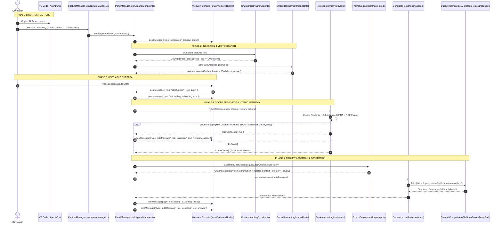

# End-to-End System & Component Flow (`docs/flow.md`)

## Document Details
- **Document Version:** 1.0.0
- **Status:** Active / Living Engineering Trace
- **Tracking:** Updated whenever a file implementation is completed or refactored.

---

## 1. High-Level Runtime Flow



---

## 2. Detailed Step-by-Step Execution Traces

### Trace A: Universal Context Capture
1. **Trigger Options:**
   - **Keyboard Shortcut:** User presses `Ctrl+Alt+Q` $\rightarrow$ `CaptureManager.captureFromClipboard()` reads OS clipboard via `vscode.env.clipboard.readText()`.
   - **Header Button:** User clicks `📋 Paste Clipboard` in the Webview $\rightarrow$ posts `{ type: 'pasteClipboard' }` to `PanelManager`.
   - **Editor Context Menu:** Right-click highlighted text $\rightarrow$ `contextQa.askAboutSelection` reads active editor selection.
   - **Status Bar Icon:** Click `$(sparkle) Context Q&A` $\rightarrow$ reveals panel.
2. **Context Activation:**
   - `handleCapturedResponse(text)` is invoked.
   - First 200 characters are formatted with ellipsis for the `Scoped Context` header preview.
   - Character count and estimated token count (`Math.ceil(length / 4)`) are computed.
   - Webview UI receives `postMessage({ type: 'setContext', preview, stats })` and clears any old chat thread.

---

### Trace B: Ingestion & Structural Chunking
1. `chunkText(rawText, options)` receives the raw captured response.
2. Regex scan extracts all fenced code blocks (` ```lang ... ``` `):
   - Blocks $\le 200$ tokens are preserved as **atomic code chunks** (`type: 'code'`).
   - Blocks $> 200$ tokens are split on newline/statement boundaries with a 2-line overlap, preserving ```lang fences on every segment.
3. Text outside code fences is split into paragraphs (`\n\s*\n`):
   - Small paragraphs are accumulated up to the 200-token ceiling.
   - Paragraphs exceeding 200 tokens are split on sentence boundaries (`. ! ?`).
   - Bulleted / numbered lists are tagged as `type: 'list'`.
4. Returns deterministic sequential chunks (`chunk-0`, `chunk-1`, etc.).

---

### Trace C: In-Memory Indexing & Embedding
1. `embedder.ts` initializes the quantized `Xenova/all-MiniLM-L6-v2` pipeline via `@xenova/transformers`.
2. Each chunk text is passed through the model to produce a 384-dimensional $L_2$-normalized vector.
3. Chunks and their vectors are cached in a plain JavaScript array in `panelManager.ts`.
4. In-memory BM25 index pre-tokenizes chunk texts using `tokenizeCodeAndProse` (splitting camelCase and snake_case).

---

### Trace D: Hybrid Retrieval & Scope Guardrail
1. User submits a question via the Webview input box.
2. The query is embedded into a 384d vector and sub-tokenized for BM25.
3. **Scope Pre-Check:**
   - Evaluates maximum cosine similarity across all chunks.
   - If $\max(\text{Cosine}) < 0.20$ AND BM25 term matches $= 0$ AND query is NOT a meta-transformation (*"explain simpler"*, *"summarize"*):
   - **Short-circuit:** Skips the LLM network call entirely and outputs the out-of-scope refusal banner.
4. **Reciprocal Rank Fusion:**
   - Computes dense cosine similarity rankings.
   - Computes BM25 keyword rankings.
   - Fuses ranks using $RRF(d) = \frac{1}{60 + \text{Rank}_{\text{BM25}}(d)} + \frac{1}{60 + \text{Rank}_{\text{Vector}}(d)}$.
   - Normalizes to $[0, 1]$ via $\frac{RRF(d)}{2/61}$.
   - Returns the Top $K$ (default: 3) highest-scoring chunks.

---

### Trace E: Prompt Assembly & Grounded Generation
1. `assembleChatMessage(query, topChunks, history, maxHistoryTurns)` in `src/llm/prompt.ts`:
   - Injects `SYSTEM_INSTRUCTION` as `role: 'system'`.
   - Injects `buildAgentContext(topChunks)` as `role: 'system'`.
   - Injects sliding window `conversationHistory.slice(-maxHistoryTurns * 2)` as alternating `role: 'user'` / `role: 'assistant'`.
   - Injects active user query as `role: 'user'`.
2. `generator.ts` retrieves the API key from VS Code `SecretStorage` (`context.secrets.get('contextQa.apiKey')`).
3. Sends HTTP POST request to the configured OpenAI-compatible endpoint (`contextQa.apiBaseUrl`, model `contextQa.modelName`).
4. The LLM produces an answer formatted with the 3-Zone rules:
   - Factual context answers cite `[Chunk X]`.
   - Expanded subtopics display dual source badges (`📌 From Captured Response` vs `🌐 Deep-Dive & Implementation`).
5. Webview receives the message, renders bubbles, hides the loading spinner, and auto-scrolls to bottom.

---

## 3. File-by-File Implementation & Live Completion Status

| File Path | Component Layer | Core Responsibility | Current Status |
|---|---|---|---|
| [package.json](file:///a:/Personal/projects/Agentic-chat-Q&A-bot/package.json) | Configuration | Extension manifests, commands, keybindings, settings, path-safe scripts | ✅ **COMPLETE** |
| [tsconfig.json](file:///a:/Personal/projects/Agentic-chat-Q&A-bot/tsconfig.json) | Configuration | Strict TypeScript compiler options | ✅ **COMPLETE** |
| [src/extension.ts](file:///a:/Personal/projects/Agentic-chat-Q&A-bot/src/extension.ts) | Lifecycle | Extension activation, command registration, lifecycle disposal | ✅ **COMPLETE** |
| [src/captureManager.ts](file:///a:/Personal/projects/Agentic-chat-Q&A-bot/src/captureManager.ts) | Ingestion / Capture | Universal clipboard, shortcut (`Ctrl+Alt+Q`), status bar, context menu | ✅ **COMPLETE** |
| [src/ui/panelManager.ts](file:///a:/Personal/projects/Agentic-chat-Q&A-bot/src/ui/panelManager.ts) | UI / Orchestration | Singleton Webview panel lifecycle, message broker, history management | ✅ **COMPLETE** |
| [src/ui/webviewHtml.ts](file:///a:/Personal/projects/Agentic-chat-Q&A-bot/src/ui/webviewHtml.ts) | Presentation | Native VS Code themed HTML/CSS/JS chat interface, badges, spinner | ✅ **COMPLETE** |
| [src/rag/types.ts](file:///a:/Personal/projects/Agentic-chat-Q&A-bot/src/rag/types.ts) | RAG Core Contracts | Data contracts (`Chunk`, `ScoredChunk`, `ChunkerOptions`, `RetrieverOptions`) | ✅ **COMPLETE** |
| [src/llm/prompt.ts](file:///a:/Personal/projects/Agentic-chat-Q&A-bot/src/llm/prompt.ts) | LLM / Prompts | 3-tier instruction hierarchy, system constitution, context injection, memory | ✅ **COMPLETE** |
| [src/rag/chunker.ts](file:///a:/Personal/projects/Agentic-chat-Q&A-bot/src/rag/chunker.ts) | RAG Ingestion | Structural markdown parser, atomic code fences, 200-token ceiling | ✅ **COMPLETE** |
| [src/rag/embedder.ts](file:///a:/Personal/projects/Agentic-chat-Q&A-bot/src/rag/embedder.ts) | RAG Vectorization | Local ONNX `all-MiniLM-L6-v2` dense vector generator | 📋 **PLANNED** |
| [src/rag/retriever.ts](file:///a:/Personal/projects/Agentic-chat-Q&A-bot/src/rag/retriever.ts) | RAG Retrieval | In-memory Cosine + Sub-tokenized BM25 + Normalized RRF Fusion | 📋 **PLANNED** |
| [src/llm/generator.ts](file:///a:/Personal/projects/Agentic-chat-Q&A-bot/src/llm/generator.ts) | LLM Engine | OpenAI-compatible HTTP fetch, SecretStorage key resolution, error handling | 📋 **PLANNED** |
| [test/unit/capture.test.ts](file:///a:/Personal/projects/Agentic-chat-Q&A-bot/test/unit/capture.test.ts) | Testing | Unit tests for clipboard processing, stats calculation, empty inputs | ✅ **COMPLETE** |
| [test/unit/chunker.test.ts](file:///a:/Personal/projects/Agentic-chat-Q&A-bot/test/unit/chunker.test.ts) | Testing | Unit tests for code fence preservation, token ceilings, structural typing | ✅ **COMPLETE** |
| [test/unit/retriever.test.ts](file:///a:/Personal/projects/Agentic-chat-Q&A-bot/test/unit/retriever.test.ts) | Testing | Unit tests for BM25 identifier matching (`getUserById`) and RRF scoring | 📋 **PLANNED** |
| [test/unit/prompts.test.ts](file:///a:/Personal/projects/Agentic-chat-Q&A-bot/test/unit/prompts.test.ts) | Testing | Unit tests for prompt message assembly and sliding window memory | 📋 **PLANNED** |
