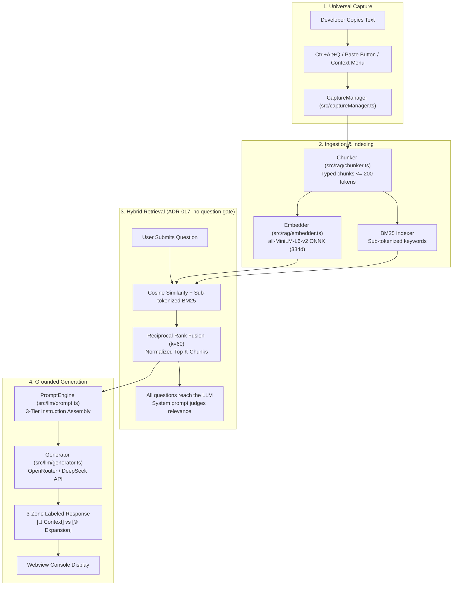
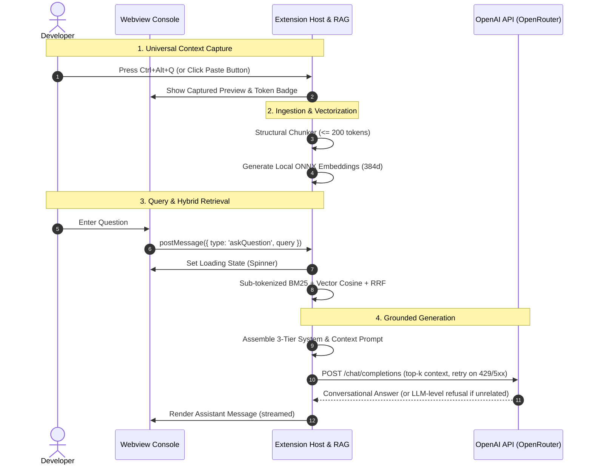

# End-to-End System & Component Flow (`docs/flow.md`)

## Document Details
- **Document Version:** 1.0.0
- **Status:** Active / Living Engineering Trace
- **Tracking:** Updated whenever a file implementation is completed or refactored.

---

## 1. High-Level Runtime Architecture



---

## 2. Interactive Runtime Sequence



---

## 3. Detailed Step-by-Step Execution Traces

### Trace A: Universal Context Capture
1. **Trigger Options:**
   - **Keyboard Shortcut:** User presses `Ctrl+Alt+Q` $\rightarrow$ `CaptureManager.captureFromClipboard()` reads OS clipboard via `vscode.env.clipboard.readText()`.
    - **Header Button:** User clicks `📋 Paste Clipboard` in the Webview $\rightarrow$ posts `{ type: 'pasteClipboard' }` to `SidebarProvider`.
   - **Editor Context Menu:** Right-click highlighted text $\rightarrow$ `contextQa.askAboutSelection` reads active editor selection.
   - **Status Bar Icon:** Click `$(sparkle) Context Q&A` $\rightarrow$ reveals panel.
2. **Context Activation:**
   - `handleCapturedResponse(text)` is invoked.
   - First 200 characters are formatted with ellipsis for the `Scoped Context` header preview.
   - Character count and estimated token count (`Math.ceil(length / 4)`) are computed.
   - Webview UI receives `postMessage({ type: 'setContext', preview, stats })` and clears any old chat thread.

---

### Trace B: Ingestion & Structural Chunking
1. `chunkText(rawText, options)` receives the raw captured response.
2. Regex scan extracts all fenced code blocks (` ```lang ... ``` `):
   - Blocks $\le 200$ tokens are preserved as **atomic code chunks** (`type: 'code'`).
   - Blocks $> 200$ tokens are split on newline/statement boundaries with a 2-line overlap, preserving ```lang fences on every segment.
3. Text outside code fences is split into paragraphs (`\n\s*\n`):
   - Small paragraphs are accumulated up to the 200-token ceiling.
   - Paragraphs exceeding 200 tokens are split on sentence boundaries (`. ! ?`).
   - Bulleted / numbered lists are tagged as `type: 'list'`.
4. Returns deterministic sequential chunks (`chunk-0`, `chunk-1`, etc.).

---

### Trace C: In-Memory Indexing & Embedding
1. `embedder.ts` initializes the quantized `Xenova/all-MiniLM-L6-v2` pipeline via `@xenova/transformers`.
2. Each chunk text is passed through the model to produce a 384-dimensional $L_2$-normalized vector.
3. Chunks, vectors, and pre-tokenized keyword sets are cached in a plain JavaScript array in `SidebarProvider.ts`; a monotonic `generationCounter` invalidates stale in-flight questions on new captures (ADR-018).
4. In-memory BM25 index pre-tokenizes chunk texts using `tokenizeCodeAndProse` (splitting camelCase and snake_case).

---

### Trace D: Hybrid Retrieval (ADR-017 — Gate Removed 2026-09-12)
1. User submits a question via the Webview input box.
2. `handleUserQuestion` snapshots `generationCounter`; stale runs are discarded if a newer capture lands mid-flight (ADR-018).
3. The query is embedded into a 384d vector and sub-tokenized for BM25 (chunk keyword sets come from the capture-time cache).
4. **No question-level gate:** every question proceeds to generation while captured context exists. The system prompt (rule 3) is the single relevance judge.
5. **Reciprocal Rank Fusion:**
    - Computes dense cosine similarity rankings.
    - Computes BM25 keyword rankings.
    - Fuses ranks using $RRF(d) = \frac{1}{60 + \text{Rank}_{\text{BM25}}(d)} + \frac{1}{60 + \text{Rank}_{\text{Vector}}(d)}$.
    - Normalizes to $[0, 1]$ via $\frac{RRF(d)}{2/61}$.
    - Returns the Top $K$ (adaptive per intent) highest-scoring chunks.

---

### Trace E: Prompt Assembly & Grounded Generation
1. `assembleChatMessage(query, topChunks, history, maxHistoryTurns)` in `src/llm/prompt.ts`:
   - Injects `SYSTEM_INSTRUCTION` as `role: 'system'`.
   - Injects `buildAgentContext(topChunks)` as `role: 'system'`.
   - Injects sliding window `conversationHistory.slice(-maxHistoryTurns * 2)` as alternating `role: 'user'` / `role: 'assistant'`.
   - Injects active user query as `role: 'user'`.
2. `generator.ts` retrieves the API key from VS Code `SecretStorage` (`context.secrets.get('contextQa.apiKey')`).
3. Sends HTTP POST request to the resolved provider endpoint (`contextQa.provider` preset via `resolveBaseUrl()`, or `contextQa.apiBaseUrl` when provider is `custom`; model `contextQa.modelName`). Model can be picked from the live `GET /models` dropdown in the sidebar (ADR-020).
4. The LLM produces an answer formatted with the 3-Zone rules:
   - Factual context answers cite `[Chunk X]`.
   - Expanded subtopics display dual source badges (`📌 From Captured Response` vs `🌐 Deep-Dive & Implementation`).
5. Webview receives the message, renders bubbles, hides the loading spinner, and auto-scrolls to bottom.

---

## 4. File-by-File Implementation & Live Completion Status

| File Path | Component Layer | Core Responsibility | Current Status |
|---|---|---|---|
| [package.json](file:///a:/Personal/projects/Agentic-chat-Q&A-bot/package.json) | Configuration | Extension manifests, commands, keybindings, settings, path-safe scripts | ✅ **COMPLETE** |
| [tsconfig.json](file:///a:/Personal/projects/Agentic-chat-Q&A-bot/tsconfig.json) | Configuration | Strict TypeScript compiler options | ✅ **COMPLETE** |
| [README.md](file:///a:/Personal/projects/Agentic-chat-Q&A-bot/README.md) | Documentation | Public GitHub overview, architecture, quick start, advantages | ✅ **COMPLETE** |
| [docs/chunking-strategy.md](file:///a:/Personal/projects/Agentic-chat-Q&A-bot/docs/chunking-strategy.md) | Documentation | Structural code chunking specification & 200-token ceiling rationale | ✅ **COMPLETE** |
| [LICENSE](file:///a:/Personal/projects/Agentic-chat-Q&A-bot/LICENSE) | Legal | Open-source MIT License | ✅ **COMPLETE** |
| [.gitignore](file:///a:/Personal/projects/Agentic-chat-Q&A-bot/.gitignore) | Repository Hygiene | Secret isolation, build/ONNX cache exclusion rules | ✅ **COMPLETE** |
| [src/extension.ts](file:///a:/Personal/projects/Agentic-chat-Q&A-bot/src/extension.ts) | Lifecycle | Extension activation, command registration, lifecycle disposal | ✅ **COMPLETE** |
| [src/captureManager.ts](file:///a:/Personal/projects/Agentic-chat-Q&A-bot/src/captureManager.ts) | Ingestion / Capture | Universal clipboard, shortcut (`Ctrl+Alt+Q`), status bar, context menu | ✅ **COMPLETE** |
| [src/ui/SidebarProvider.ts](file:///a:/Personal/projects/Agentic-chat-Q&A-bot/src/ui/SidebarProvider.ts) | UI / Orchestration | Sidebar WebviewView lifecycle, message broker, history, RAG orchestration, cancellation guard (ADR-018), provider resolution + model-list broker + config watcher (ADR-020) | ✅ **COMPLETE** |
| [src/ui/webviewHtml.ts](file:///a:/Personal/projects/Agentic-chat-Q&A-bot/src/ui/webviewHtml.ts) | Presentation | Native VS Code themed HTML/CSS/JS chat interface, badges, spinner, QA Assistant branding + watermark layer (ADR-019), upward model-picker dropdown with debounced search + pin favorites (ADR-020, ADR-021) | ✅ **COMPLETE** |
| [src/ui/qaMark.ts](file:///a:/Personal/projects/Agentic-chat-Q&A-bot/src/ui/qaMark.ts) | Brand / Asset | Logo mark single source of truth (`QA_MARK_INNER` + `qaMarkSvg`), bracket-node concept (ADR-019) | ✅ **COMPLETE** |
| [media/qa-mark.svg](file:///a:/Personal/projects/Agentic-chat-Q&A-bot/media/qa-mark.svg) | Brand / Asset | Standalone mark copy + activity-bar container icon (ADR-019) | ✅ **COMPLETE** |
| [media/watermark-demo.html](file:///a:/Personal/projects/Agentic-chat-Q&A-bot/media/watermark-demo.html) | Brand / Proof | Standalone dark+light watermark legibility demo (ADR-019) | ✅ **COMPLETE** |
| [test/unit/qaMark.test.ts](file:///a:/Personal/projects/Agentic-chat-Q&A-bot/test/unit/qaMark.test.ts) | Testing | Unit tests for viewBox, currentColor-only, single stroke weight, sizing, aria | ✅ **COMPLETE** |
| [src/rag/types.ts](file:///a:/Personal/projects/Agentic-chat-Q&A-bot/src/rag/types.ts) | RAG Core Contracts | Data contracts (`Chunk`, `ScoredChunk`, `ChunkerOptions`, `RetrieverOptions`) | ✅ **COMPLETE** |
| [src/llm/prompt.ts](file:///a:/Personal/projects/Agentic-chat-Q&A-bot/src/llm/prompt.ts) | LLM / Prompts | 3-tier instruction hierarchy, system constitution, context injection, memory | ✅ **COMPLETE** |
| [src/rag/chunker.ts](file:///a:/Personal/projects/Agentic-chat-Q&A-bot/src/rag/chunker.ts) | RAG Ingestion | Structural markdown parser, atomic code fences, 200-token ceiling | ✅ **COMPLETE** |
| [src/rag/embedder.ts](file:///a:/Personal/projects/Agentic-chat-Q&A-bot/src/rag/embedder.ts) | RAG Vectorization | Local ONNX `all-MiniLM-L6-v2` dense vector generator | ✅ **COMPLETE** |
| [src/rag/retriever.ts](file:///a:/Personal/projects/Agentic-chat-Q&A-bot/src/rag/retriever.ts) | RAG Retrieval | In-memory Cosine + Sub-tokenized BM25 + Normalized RRF Fusion, no question gate (ADR-017), cached chunk tokens (ADR-018) | ✅ **COMPLETE** |
| [src/llm/generator.ts](file:///a:/Personal/projects/Agentic-chat-Q&A-bot/src/llm/generator.ts) | LLM Engine | OpenAI-compatible HTTP fetch, SecretStorage key resolution, error handling, 429/5xx retry with backoff (ADR-018), conditional OpenRouter headers (ADR-020) | ✅ **COMPLETE** |
| [src/llm/providers.ts](file:///a:/Personal/projects/Agentic-chat-Q&A-bot/src/llm/providers.ts) | LLM / Providers | Single provider preset table + pure URL/header resolvers, custom-slot support (ADR-020) | ✅ **COMPLETE** |
| [src/llm/modelList.ts](file:///a:/Personal/projects/Agentic-chat-Q&A-bot/src/llm/modelList.ts) | LLM / Providers | Live `GET /models` fetcher, never-throws null fallback, sorted `ModelItem` parsing (ADR-020) | ✅ **COMPLETE** |
| [test/unit/providers.test.ts](file:///a:/Personal/projects/Agentic-chat-Q&A-bot/test/unit/providers.test.ts) | Testing | Unit tests for preset URLs, custom slot, unknown-id fallback, key needs, conditional headers | ✅ **COMPLETE** |
| [test/unit/modelList.test.ts](file:///a:/Personal/projects/Agentic-chat-Q&A-bot/test/unit/modelList.test.ts) | Testing | Unit tests for OpenAI/OpenRouter shapes, sorting, malformed bodies, fetch failures, auth omission | ✅ **COMPLETE** |
| [test/unit/webviewModels.test.ts](file:///a:/Personal/projects/Agentic-chat-Q&A-bot/test/unit/webviewModels.test.ts) | Testing | Render tests for picker markup, hidden defaults, message cases, upward anchoring, search/favorites/count wiring (ADR-021) | ✅ **COMPLETE** |
| [test/unit/capture.test.ts](file:///a:/Personal/projects/Agentic-chat-Q&A-bot/test/unit/capture.test.ts) | Testing | Unit tests for clipboard processing, stats calculation, empty inputs | ✅ **COMPLETE** |
| [test/unit/chunker.test.ts](file:///a:/Personal/projects/Agentic-chat-Q&A-bot/test/unit/chunker.test.ts) | Testing | Unit tests for code fence preservation, token ceilings, structural typing | ✅ **COMPLETE** |
| [test/unit/embedder.test.ts](file:///a:/Personal/projects/Agentic-chat-Q&A-bot/test/unit/embedder.test.ts) | Testing | Unit tests for 384d vector generation, L2 normalization, and batching | ✅ **COMPLETE** |
| [test/unit/retriever.test.ts](file:///a:/Personal/projects/Agentic-chat-Q&A-bot/test/unit/retriever.test.ts) | Testing | Unit tests for BM25 identifier matching (`getUserById`), RRF, and guardrail | ✅ **COMPLETE** |
| [test/unit/prompts.test.ts](file:///a:/Personal/projects/Agentic-chat-Q&A-bot/test/unit/prompts.test.ts) | Testing | Unit tests for prompt message assembly and sliding window memory | ✅ **COMPLETE** |
